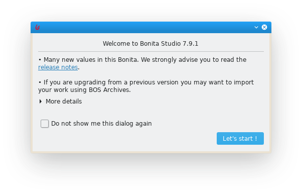
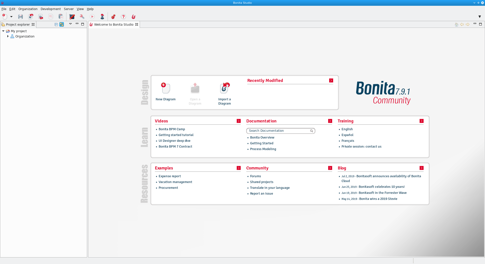
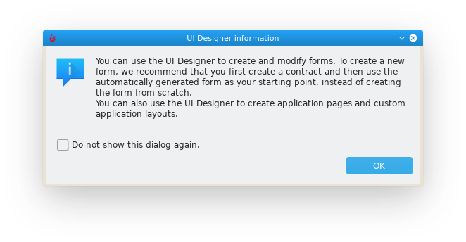

# Bonita Studio installation

The first step of this getting started tutorial is to setup your development environment. All you need is actually to install Bonita Studio.

::: info
If you face any difficulties in this getting started tutorial, please ask for help on [community Q&A](https://community.bonitasoft.com/questions-and-answers) and/or open an issue on our [community issue tracker](https://bonita.atlassian.net/projects/BBPMC/issues).
:::

## Download Bonita Studio

To download Bonita Studio latest version, open the [download page](https://www.bonitasoft.com/downloads) and start the download by clicking on the "Download" button. This will start the download of Bonita Studio installer for your operating system.

Once download is finished you should have one of the following file on your computer (x.y.z refers to the Studio version, e.g. 7.9.1):
- Windows: `BonitaStudioCommunity-x.y.z-x86_64.exe`
- macOS: `BonitaStudioCommunity-x.y.z-x86_64.dmg`
- Linux: `BonitaSubscription-x.y.z-x86_64.run`

You are now ready to start the installation process.

## Install Bonita Studio

To run the installer for Windows, macOS or Linux, double-click on previously downloaded file.

Installer will guide you through a very basic installation configuration:
1. Select installation language: this will be used for the installation process.
1. Welcome message: click on "Next" button.
1. License agreement: you need to accept it to continue.
1. Installation directory: the default one should be just fine.
1. Confirmation that installation is about to start: just click on "Next" button.
1. Actual installation: wait a little bit.
1. Confirmation message that offer the option to start the Studio: choose to start the Studio and click on "Finish" button.
1. A "thank you for download" page will be displayed in your web browser. You can close it.

The Studio is now installed. Default installation folders are:
- Windows: `C:\BonitaStudioCommunity-x.y.z`
- macOS: `/Applications/BonitaStudioCommunity-x.y.z`
- Linux: `/home/<username>/BonitaStudioCommunity-x.y.z`

## First Studio execution

At this stage your Studio should be running on your computer. If not you can manually start it by using the installed shortcut or by using the Studio executable file from the installation folder.

On the first Studio startup you will get the following pop-up window:

You can ignore it.

And finally you should get the Studio displaying the welcome page:

::: info
When Studio start, various tasks are executed in the background such as embedded Bonita test server startup (including Bonita Engine initialization), Bonita test organization deployment...
This might take a while and can explain why some features are not immediately available.
:::

## Installation validation

In order to make sure that everything is properly installed click on the button in the toolbar to open Bonita Portal:

This should open the Bonita Portal home page in your web browser:

Also click on the button in the toolbar to open Bonita UI Designer tool:

This will display a pop-up window that you can ignore:

And then the UI Designer should be opened in your web browser:

## Ready to move on

At this stage the Studio is successfully installed and all the tools and test environment are up and running.
You are ready to move to the next chapter to start creating your first process.
