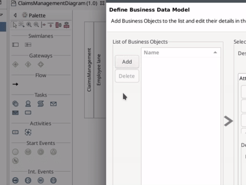

# Define business data model (BDM)

Bonita provides a solution to define, manipulate and store your business data. This data management service will take care of creating Java objects to allow data manipulation, database tables for storage and all operations required to get the data from your process to the database and the other way around.

Data management will involve several steps:
- Business Data Model (BDM). This is the definition of the types of data you will deal with in your processes and applications.
- Declaration of business variable in the process definition. Variables are used to make the link between your process definition and the data it needs to create, read, update, and delete. Data can be create as part of process execution (on start or on a task) but processes can also read and update data created by other processes and of course can choose to delete data.
- Definition of processes and tasks contracts. Contracts define the information process excepts from the user submitting the form.

In this chapter we will focus on the creation of the Business Data Model (BDM) only. Declaration of business variables is part of the next chapter.

In Bonita Studio, create a BDM:
1. Go in **Development > Business Data Model > Define...** menu

  
  
1. Click on **Add** button
1. Type the object name _Claim_ (objects name must always start with an uppercase letter)
1. In the **Attributes** tab, click on **Add** button
1. You need to add 3 attributes (attributes name must always start with a lowercase letter):
  1. _description_ of type _STRING_ and _mandatory_ (you need to check the checkbox in the **mandatory** column)
  1. _answer_ of type _STRING_, _optional_
  1. _satisfactionLevel_ of type _INTEGER_, 
  
  
  
1. Click on **Finish** button

::: info
**mandatory** option on a object attribute means that the object cannot be create with an empty value for this attribute. If **mandatory** option is not checked, it means that object can exist with an empty value for the attribute "not mandatory" (i.e. optional). In our example, the _answer_ attribute is optional because at process start it will be empty. Later in the process execution, an employee will provide an answer and doing so will be mandatory (but will not be enforced by BDM definition).
:::

::: warning
When you edit the BDM in the Studio it is always recommend to choose to reset the database after doing some modification on the model. You just need to check the checkbox "Reset BDM database" available in the pop-up window display when you validate your modifications.
:::

::: info
When you click on "Finish" button three different operations are performed:
- BDM definition is saved in your project (under **Business Data Model** category)
- Java classes are generated, compiled, packaged and the resulting jar file is added to your project (under **Java dependencies** category)
- Tables are created in the Studio embedded test database

:::

::: info
Studio relies on h2 to provide database for testing (you can use other types of databases such as Oracle, PostgreSQL, MySQL and SQL Server for production). Studio provides two database schemas: one for Bonita Engine and one dedicated to BDM. You can view the tables create in the h2 BDM database by clicking in the Studio menu on **Development > Business Data Model > Browse data (h2 console)...**. In the h2 console (a web interface) you can see that a table named "CLAIM" was created. You can run an SQL query such as `SELECT * FROM CLAIM` that should returns an empty result as we don't have any data yet.
:::

Now you have a fully functional business data management model. Your are ready to move to the next chapter and start populating the database with data collected by the process. 
