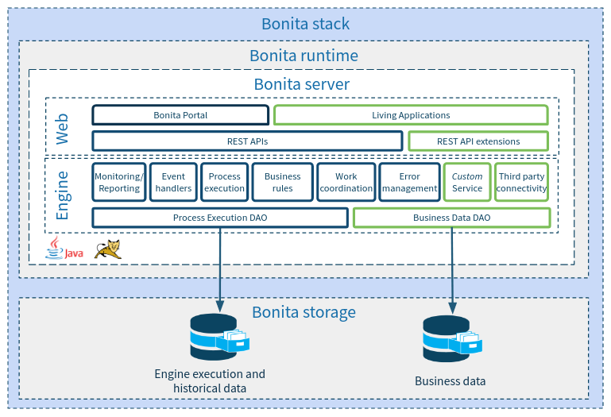

# What's is Bonita

Welcome to this Bonita getting started tutorial. On this page you will find a quick overview of what you can do with Bonita and also an introduction to the Bonita architecture.

If you can't wait to start creating your first application with Bonita, you can safely skip this page and move to the [download and installation](bonita-studio-download-installation.md) of Bonita Studio.

## What can I do with Bonita?

Bonita is a Digital Process Automation platform that allow you to create applications based on processes. Processes can be  partially (if involving users) or fully automated.

Bonita applies to a wide range of use cases: applications can go from loan requests management to students applications processes as well as analytical processes in drug discovery and more! You can find the various industries where Bonita can be used as well as use cases from our [website dedicated page](https://www.bonitasoft.com/industries).

## How do I create a Bonita application?

Thanks to Bonita low-code approach you won't need to write a lot of code to create an application. Creation of Bonita applications relies heavily on models: process model (using BPMN standard), data model for business data management, WYSIWYG tool for user interfaces design...

Creating an application in Bonita Studio (the Bonita development environment) requires to perform the following steps:
- graphical design of one or several processes using BPMN notation
- definition of data model using the Bonita Business Data Management feature (you can of course use your own database if needed)
- creation of web user interfaces using Bonita UI Designer (or your preferred web framework)
- definition of users involved in the application (? involved in the process sounds better : we build an application to optimize and automate processes?)
- configuration of connectors to integrate Bonita with the information system (e.g. to send an email, call a web service...)

We will cover all these steps in this getting started tutorial so you can get familiar with all the concepts behind a Bonita application.

## Overview of the Bonita solution architecture

### Bonita Studio

Bonita Studio provides everything you need to develop and build a Bonita application. Bonita Studio is a desktop application built on top of Eclipse.

It provides :
- capabilities to model BPMN (Business Process Modeling Notation) processes
- capabilities to model BDM (Business Data Model)
- capabilities to model user interfaces (UI Designer)
- capabilities to model applications
- an embedded Bonita stack (defined below), exclusively dedicated to local application testing performed by the application developer.

Bonita Studio is not intended for any use other than development. As a consequence, the Bonita stack embedded into the Bonita Studio must not be used for production purposes.

### Bonita stack, runtime and server

Bonita stack refers to all the components you need to deploy in order to make applications available to end users in production. It includes the Bonita runtime and the two database schemas (one for Bonita Engine and one for business data).

A Bonita runtime includes a single Bonita server in Community Edition. In Enterprise Edition, a Bonita runtime can include several Bonita servers to create a cluster for high performance and availability.

A Bonita server is composed of two components : the Bonita Engine that is in charge for example of processes execution and the web portal which provides the end user and administration web interface.

The Bonita server is a standalone Java application running in a Java application server installed on a host (a machine, a virtual machine, a cloud instance, a container like Docker…).

Now that you got the Bonita global picture you should be ready to move to the next step: [download and install Bonita Studio](bonita-studio-download-installation.md).

